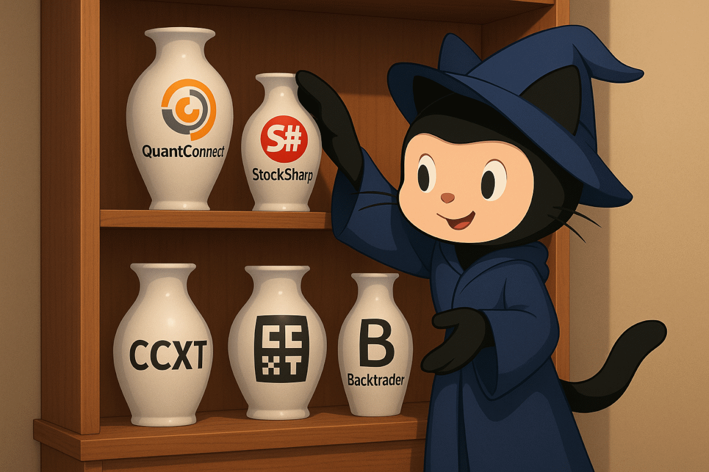

# OSA Engine - Открытые платформы для алгоритмической торговли



Добро пожаловать в репозиторий [OSA Engine](https://osaengine.ru) - ведущего каталога open-source платформ для алгоритмической торговли и автоматизированных торговых стратегий.

## 🚀 О проекте

**OSA Engine** (Open Source Algotrading Engine) - это комплексный ресурс для трейдеров, разработчиков и аналитиков, который объединяет лучшие открытые решения для алгоритмической торговли. Наша платформа предоставляет полную информацию о торговых роботах, стратегиях и инструментах автоматизации торговли.

## 📈 Что вы найдете на OSA Engine

### Торговые платформы и движки
- **QuantConnect LEAN** - облачная платформа для разработки алгоритмов
- **StockSharp** - профессиональная платформа для создания торговых роботов
- **Backtrader** - Python-фреймворк для бэктестинга стратегий
- **Zipline** - библиотека для алгоритмической торговли от Quantopian
- **QuantLib** - инструменты для количественного анализа

### Торговые стратегии и роботы
- Готовые алгоритмические стратегии
- Бесплатные торговые роботы
- Индикаторы технического анализа
- Системы управления рисками
- Портфельные стратегии

### Интеграции с брокерами
- Подключение к российским брокерам (Тинькофф, Алор, Финам)
- Интеграция с международными площадками
- API для криптовалютных бирж
- Работа с терминалом QUIK

## 🎯 Основные преимущества

- **Открытый исходный код**: Все представленные решения имеют открытый код
- **Бесплатный доступ**: Большинство платформ и стратегий доступны бесплатно
- **Профессиональное качество**: Только проверенные и надежные решения
- **Активное сообщество**: Поддержка от опытных разработчиков и трейдеров
- **Обучающие материалы**: Гайды, FAQ и практические примеры

## 🛠 Технологии и языки программирования

Платформы поддерживают различные языки программирования:
- **Python** - Backtrader, Zipline, QuantLib
- **C#** - StockSharp, QUIKSharp
- **C++** - QuantConnect LEAN, QuantLib
- **JavaScript** - CCXT для криптотрейдинга
- **MQL4/MQL5** - MetaTrader экосистема

## 📊 Типы торговых стратегий

### Классические стратегии
- Арбитражные стратегии
- Трендовые системы
- Контртрендовые алгоритмы
- Парный трейдинг
- Скальпинг роботы

### Современные подходы
- Machine Learning стратегии
- Нейронные сети в трейдинге
- Reinforcement Learning
- Sentiment анализ
- Алгоритмы высокочастотной торговли (HFT)

## 🎓 Образовательные ресурсы

- **FAQ по алготрейдингу** - ответы на популярные вопросы
- **Гайды для начинающих** - пошаговые инструкции
- **Примеры кода** - готовые решения для изучения
- **Видеоуроки и вебинары** - обучающий контент
- **Сообщество в Telegram** - общение с единомышленниками

## 🌟 Для кого подходит OSA Engine

### Начинающие трейдеры
- Изучение основ алгоритмической торговли
- Готовые стратегии для старта
- Бесплатные обучающие материалы

### Опытные трейдеры
- Продвинутые торговые алгоритмы
- Инструменты для бэктестинга
- Оптимизация существующих стратегий

### Разработчики
- Open-source решения для кастомизации
- API для интеграции с брокерами
- Сообщество для обмена опытом

### Финансовые аналитики
- Инструменты для анализа рынков
- Библиотеки для количественного анализа
- Системы управления портфелем

## 📝 Структура проекта

```
├── _data/                 # Данные для Jekyll
├── _layouts/             # Шаблоны страниц
├── _posts/               # Блог-посты
├── _faq/                 # FAQ статьи
├── assets/               # Изображения и стили
└── pages/                # Основные страницы
```

## 🚀 Быстрый старт

1. **Выберите платформу** из нашего каталога
2. **Изучите документацию** по выбранному решению
3. **Скачайте и установите** необходимые компоненты
4. **Запустите тестовую стратегию** на демо-счете
5. **Присоединяйтесь к сообществу** для получения поддержки

## 🤝 Сообщество и поддержка

- **Telegram-канал**: [@osengine_news](https://t.me/osengine_news) - новости проекта
- **Telegram-чат**: [@osengine](https://t.me/osengine) - общение с сообществом
- **GitHub**: Вклад в развитие проекта

## 📈 Популярные направления

### Российский рынок
- Торговля на Московской Бирже
- Интеграция с российскими брокерами
- Стратегии для рублевых активов
- Работа с облигациями и фьючерсами

### Международные рынки
- Торговля на NYSE, NASDAQ
- Forex алгоритмы
- Криптовалютный трейдинг
- Товарные рынки

### Современные технологии
- Искусственный интеллект в трейдинге
- Облачные вычисления
- Real-time анализ данных
- Микросервисная архитектура

## 📊 Статистика проекта

- **12+ платформ** для алгоритмической торговли
- **100+ стратегий** в открытом доступе
- **Тысячи пользователей** по всему миру
- **Активное сообщество** разработчиков и трейдеров

---

**OSA Engine** - ваш путь к успешной алгоритмической торговле. Начните сегодня с изучения нашего каталога открытых решений!