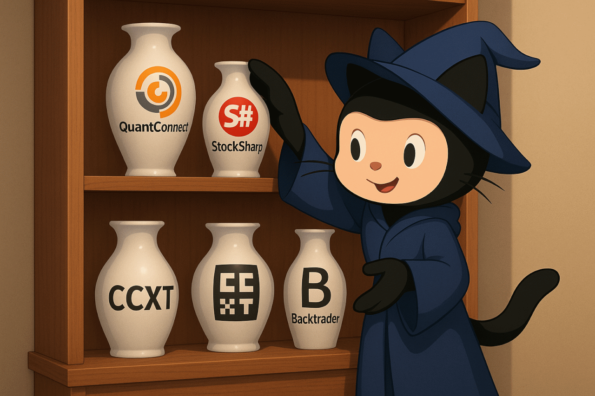

# OSA Engine — Open Source Algotrading Catalog

🌐 **[English](https://osaengine.com/en/)** | **[Русский](https://osaengine.com/ru/)** | **[中文](https://osaengine.com/zh/)** | **[Español](https://osaengine.com/es/)** | **[Deutsch](https://osaengine.com/de/)**



Comprehensive catalog of open-source platforms for algorithmic trading and automated trading strategies.

Комплексный каталог open-source платформ для алгоритмической торговли и автоматизированных торговых стратегий.

## Platforms / Платформы

- **QuantConnect LEAN** — cloud platform for algorithm development
- **StockSharp** — professional trading robot platform
- **Backtrader** — Python backtesting framework
- **Zipline** — algorithmic trading library
- **QuantLib** — quantitative analysis tools
- **CCXT** — crypto exchange connectivity
- **FreqTrade** — crypto trading bot

## Features / Возможности

- Free trading robots & strategies catalog / Каталог бесплатных роботов и стратегий
- Broker integrations (Interactive Brokers, Binance, Bybit, MOEX) / Интеграции с брокерами
- Educational resources & guides / Обучающие материалы и гайды
- Blog with algotrading insights / Блог об алготрейдинге
- Multi-language support (EN, RU, ZH, ES, DE) / Мультиязычная поддержка

## Tech Stack

- **Python** — Backtrader, Zipline, FreqTrade
- **C#** — StockSharp, QuantConnect LEAN
- **C++** — QuantLib
- **JavaScript** — CCXT
- **MQL4/MQL5** — MetaTrader

## Community / Сообщество

- Telegram: [@osengine](https://t.me/osengine)
- News: [@osengine_news](https://t.me/osengine_news)

## Project Structure

```
├── _data/i18n/        # UI translations (en, ru, zh, es, de)
├── _data/{lang}/      # Per-language data (projects, chats, bot sources)
├── _layouts/          # Jekyll templates (i18n-aware)
├── _posts/{lang}/     # Blog posts per language
├── _faq/              # FAQ articles
├── {lang}/            # Per-language pages
└── assets/            # Images & styles
```

## Quick Start

1. Choose a platform from the [catalog](https://osaengine.com/en/)
2. Explore documentation & guides
3. Download & install
4. Run a test strategy on demo account
5. Join the [community](https://t.me/osengine)

---

**OSA Engine** — your gateway to open-source algorithmic trading.
